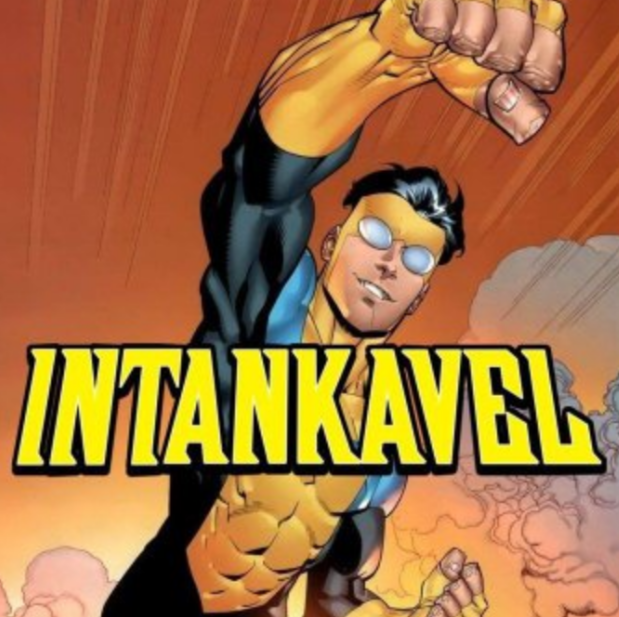

# eu sou o Shiniga-OP, e eu programo a 1 ano no celular

## estatísticas  
  
  

## tecnologias  

  

  

## projetos  
- **[Redes Neurais](https://github.com/Shiniga-OP/RedesNeurais)** -minha mini IA
- **[MiniMine](https://github.com/Shiniga-OP/MiniMine)** -meu maior jogo
- **[Fp](https://github.com/Shiniga-OP/Fp)** -o interpretador da minha linguagem de programação
- **[Fpb](https://github.com/Shiniga-OP/Fpb)** -o compilador da minha linguagem de programação (binário)
- **[Eco-Engine](https://github.com/Shiniga-OP/Eco-Engine)** -minha engine mobile
- **[Terminal Simples](https://github.com/Shiniga-OP/Terminal-simples-android)** -meu mini terminal
- **[AssemblyIDE](https://github.com/Shiniga-OP/AssemblyIDE)** -minha IDE de Assembly
- **[Neon](https://github.com/Shiniga-OP/Neon)** -meu bootloader + kernel em assembly ARM64
## contato  
**Sem contato, sou anti-social**
